# [ECCV'20] Fair DARTS: Eliminating Unfair Advantages in Differentiable Architecture Search 

*: This is the official implementation of the [FairDARTS paper](https://arxiv.org/abs/1911.12126.pdf).

Differentiable Architecture Search (DARTS) is now a widely disseminated weight-sharing neural architecture search method. However, there are two fundamental weaknesses remain untackled. First, we observe that the well-known aggregation of skip connections during optimization is caused by an unfair advantage in an exclusive competition. Second, there is a non-negligible incongruence when discretizing continuous architectural weights to a one-hot representation. Because of these two reasons, DARTS delivers a biased solution that might not even be suboptimal. In this paper, we present a novel approach to curing both frailties. Specifically, as unfair advantages in a pure exclusive competition easily induce a monopoly, we relax the choice of operations to be collaborative, where we let each operation have an equal opportunity to develop its strength. We thus call our method Fair DARTS. Moreover, we propose a zero-one loss to directly reduce the discretization gap. Experiments are performed on two mainstream search spaces, in which we achieve new state-of-the-art networks on ImageNet. 


## User Guide 

### Prerequisites

> Python 3

`pip install -r requirements.txt`

The `fairdarts` folder includes our search, train and evaluation code. The `darts` folder consists of random and noise experiments on the original DARTS. 

### Run Search

`python train_search.py --aux_loss_weight 10 --learning_rate 0.005 --batch_size 128 --parse_method threshold_sparse  --save 'EXP-lr_0005_alw_10'`

> Default batch-size is 128

### Single Model Training

`python train.py --auxiliary --cutout --arch FairDARTS_a --parse_method threshold  --batch_size 128 --epoch 600`


### Single Model Evaluation

```bash
python evaluate_model.py  --arch FairDARTS_b --model_path ../best_model/FairDARTS-b.tar --parse_method threshold
``` 

## Searched Architectures by FairDARTS 

**Note that we select architecture by barring with threshold σ, and |edge| <= 2 per node.**

> FairDARTS_a: 
<p align="center">
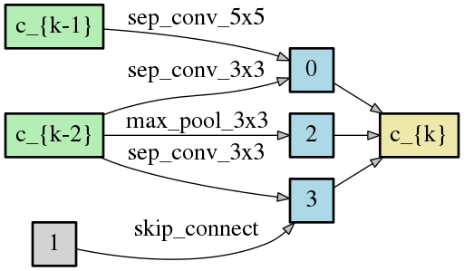
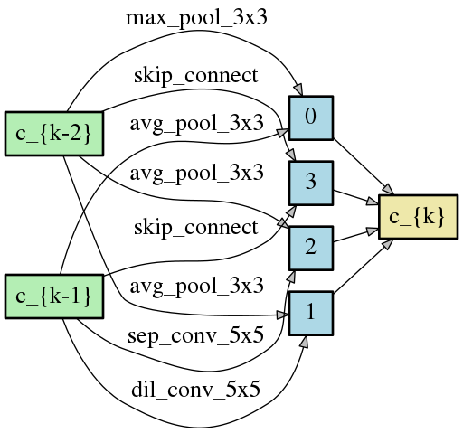
</p>


> FairDARTS_b
<p align="center">
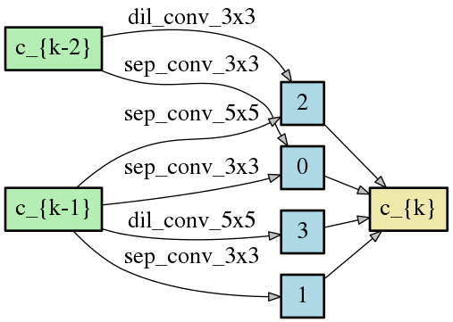
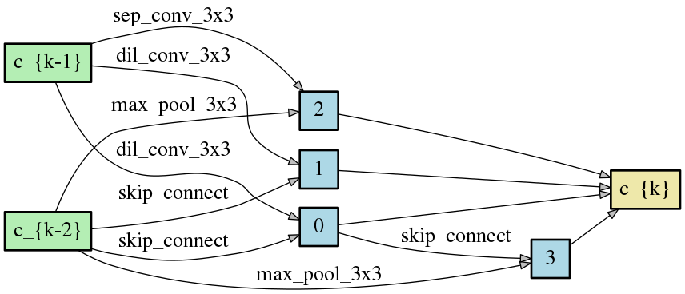
</p>


> FairDARTS_c
<p align="center">

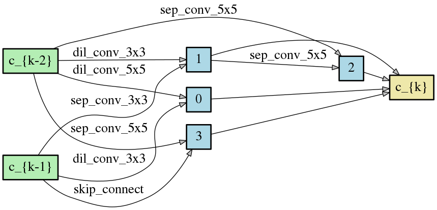
</p>


> FairDARTS_d
<p align="center">
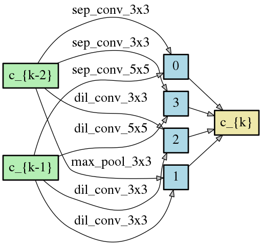
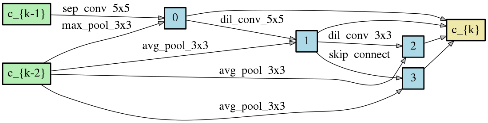
</p>

> FairDARTS_e
<p align="center">
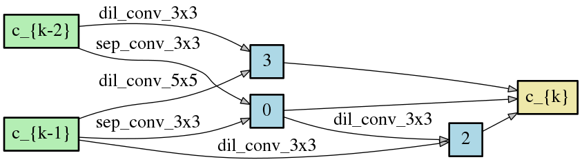
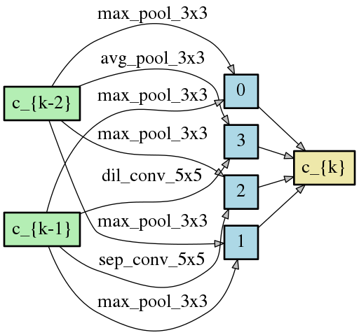
</p>


> FairDARTS_f
<p align="center">
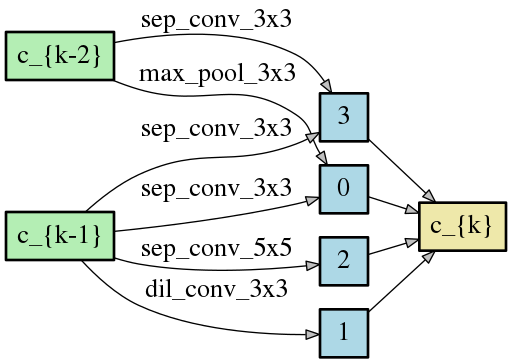
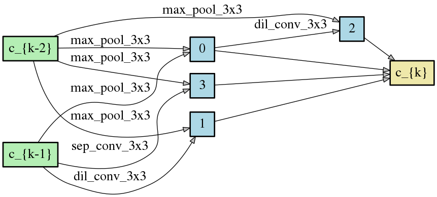
</p>


> FairDARTS_g
<p align="center">
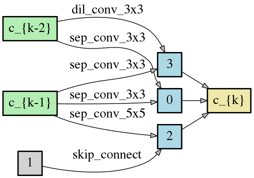
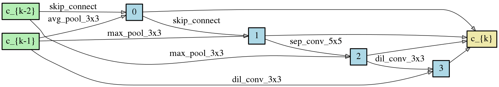
</p>


**The isolated nodes (in gray) are ignored after parsing the genotypes.**

## Evaluation Results on CIFAR-10

### Performance Stability

We run FairDARTS 7 times, all searched architectures have close performance.

|  Model  | Flops  | Params |  Performance |
|---|---|---|---|
| FairDARTS_a  | 373M   | 2.83M  |  97.46 |
| FairDARTS_b  | 536M   | 3.88M  |  97.49 |
| FairDARTS_c  | 400M   | 2.59M  |  97.50 |
| FairDARTS_d  | 532M   | 3.84M  |  97.51 |
| FairDARTS_e  |  414M  | 3.12M  |  97.47 |
| FairDARTS_f  | 497M   | 3.62M  |  97.35 |
| FairDARTS_g  | 453M   | 3.38M  |  97.46 |
| mean,var     | ~457.85M |  ~3.32M   | 97.46±0.049 |

> Note: We remove batch normalization for FLOPs' calculation in **thop package**. This is to follow status quo treamtment.

### Comparison with Other State-of-the-art Results (CIFAR-10)

 
|  Model  | FLOPs  | Params  | Batch size  | lr | DP | Optimizer | Performance |
|---|---|---|---|---|---|---|---|
| FairDARTS-a | 373M   | 2.83 | 96  |  0.025   | 0.2  | SGD+CosineAnnealingLR  | 97.46 |
| FairDARTS-b | 536M   | 3.88 | 96  |  0.025   | 0.2  | SGD+CosineAnnealingLR  | 97.49 |      
| DARTS_V2    | 522M   | 3.36 | 96  |  0.025   | 0.2  | SGD+CosineAnnealingLR  | 96.94* |
| PC-DARTS    | 558M   | 3.63 | 96  |  0.025   | 0.2  | SGD+CosineAnnealingLR  | 97.31* |
| PDARTS      | 532M   | 3.43 | 96  |  0.025   | 0.2  | SGD+CosineAnnealingLR  | 97.53* |

*: Results obtained by training their published code. 

# Citation 

    @inproceedings{chu2019fairdarts,
        title={{Fair DARTS: Eliminating Unfair Advantages in Differentiable Architecture Search}},
        author={Chu, Xiangxiang and Zhou, Tianbao and Zhang, Bo and Li, Jixiang},
        booktitle={16th Europoean Conference On Computer Vision},
        url={https://arxiv.org/abs/1911.12126.pdf},
        year={2020}
    }
    
# Acknowledgement 

 **This code is based on the implementation of  [DARTS](https://github.com/quark0/darts).**
